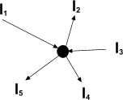
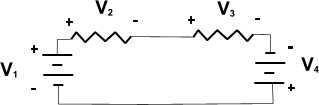

#Kirchoff's Laws

Before exploring Kirchoff's laws it is naccesary to explain some definitions.

Consider the circuit below:

{@class=centre}

BRANCH - part of the circuit connecting two NODES

NODE - the point where two or more branches meet

LOOP - closed path that formed by connecting branches

##Kirchoff's Current Law

The algebraic sum of all current in the node is equal to zero. In other words all current that arrives into the node is equal to the sum of current that leave the node.

{@class=centre}
 

Total current would be $I=I_1-I_2+I_3-I_4-I_5=0$ or $I_2+I_4=I_1+I_3+I_5$

##Kirchoff's Voltage Law

The algebraic sum of all Voltages that are surrounded by the loop is equal to zero.

{@class=centre}

