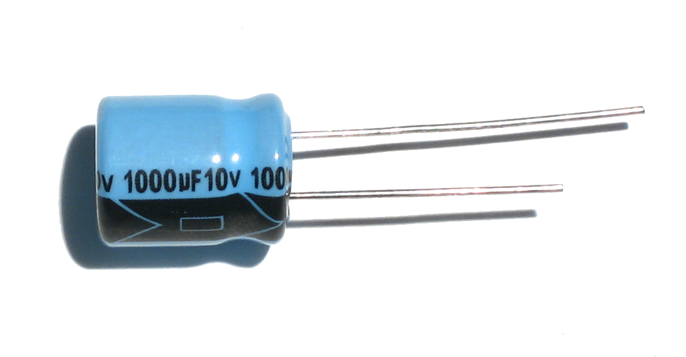

#The Capacitor

{@class=centre}

The simplest capacitor consist of two metal plates with an insulating medium (also known as dialectric) between them.
Main purpose of the capacitor is to store electric charge.

Dialectric can be any insulating material, such as air, plastic or rubber. The better insulating properties dialectric possess,
the larger ammount of charge the capacitor can hold.

##Electronic symbol of capacitor

{@class=centre}

If area of the plates and dielaectric values are known, capacitance can be found using the folowing equation

$$C=\epsilon\frac{A}{d}$$

##WATER ANALOGY (if applicable)

##Capacitors in parallel

{@class=centre}

To calculate total capacitance the folowing equation can be used

$$C=C_1+C_2+...+C_n$$

##Capacitors in series

{@class=centre}

Total capacitance is given by

$$C=\frac{1}{C_1}+\frac{1}{C_2}+...+\frac{1}{C_n$$

