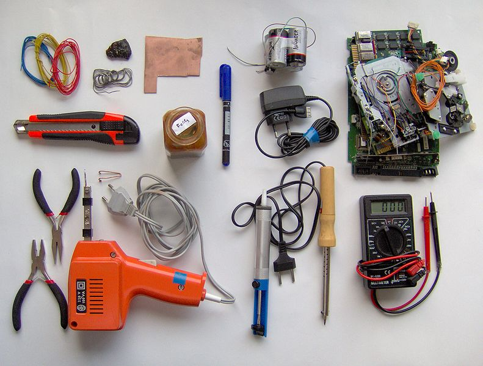

{@id=main-title}An Introduction to Electronics
==============================

{@class=centre}
[Is this course for me?](target_audience.html)

<!--
{@class=centre}
If you want to get a feel for where this will take you, have a look at the later exercises, such as [building a radio](building_a_radio.html) or [An optical fiber telephone](fiber_telephone.html).
-->

Lessons
-------

1. [Getting comfortable](lesson1.html)
2. [Fun with LEDs](lesson2.html)
3. [Sensing your world](lesson3.html)
4. [A light following robot](lesson4.html)
5. [An Optical Telephone](lesson5.html)

Principles
----------
[The water analogy](water_analogy.html)
[Kirchoff's Laws](kirchoff.html)
[Ohm's Law](ohm.html)
[Superposition theory](superposition.html)
[Th&eacute;venin's theorem](thevenin.html)
 

Components
----------
[The Resistor](resistor.html)
[The Capacitor](capacitor.html)
[The Cell Battery](battery.html)
[The Inductor](inductor.html)
[The Transistor](transistor.html)
[The Diode](diode.html)
[LDR & Thermistor](ldr_thermistor.html)
[The LED](led.html)

Miscellaneous
------------
[Other Resources](resources.html)
[Acknowledgements](acknowledgements.html)

[Attribution](attribution.html) | [Intent](intent.html) | [Who](who.html) | [Glossary](glossary.html)

