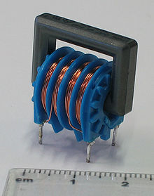

#The inductor

An inductor or a reactor is a passive electrical component that can store energy in a magnetic field created by the electric current passing through it. An inductor's ability to store magnetic energy is measured by its inductance, in units of henries. Typically an inductor is a conducting wire shaped as a coil, the loops helping to create a strong magnetic field inside the coil due to Faraday's Law of Induction. Inductors are one of the basic electronic components used in electronics where current and voltage change with time, due to the ability of inductors to delay and reshape alternating currents.

