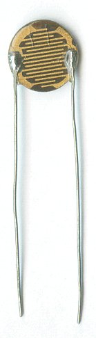

# Transistor and Thermistor

A photoresistor or light dependent resistor or cadmium sulfide (CdS) cell is a resistor whose resistance decreases with increasing incident light intensity. It can also be referred to as a photoconductor.
A photoresistor is made of a high resistance semiconductor. If light falling on the device is of high enough frequency, photons absorbed by the semiconductor give bound electrons enough energy to jump into the conduction band. The resulting free electron (and its hole partner) conduct electricity, thereby lowering resistance.
A photoelectric device can be either intrinsic or extrinsic. An intrinsic semiconductor has its own charge carriers and is not an efficient semiconductor, e.g. silicon. In intrinsic devices the only available electrons are in the valence band, and hence the photon must have enough energy to excite the electron across the entire bandgap. Extrinsic devices have impurities, also called dopants, added whose ground state energy is closer to the conduction band; since the electrons do not have as far to jump, lower energy photons (i.e., longer wavelengths and lower frequencies) are sufficient to trigger the device. If a sample of silicon has some of its atoms replaced by phosphorus atoms (impurities), there will be extra electrons available for conduction. This is an example of an extrinsic semiconductor.