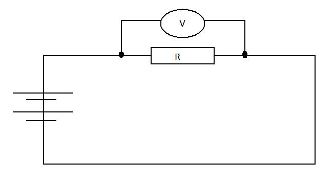
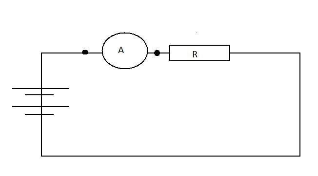
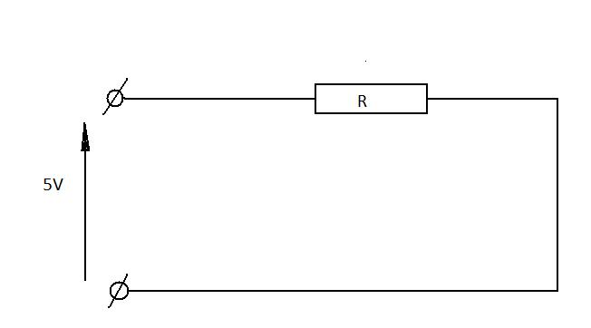
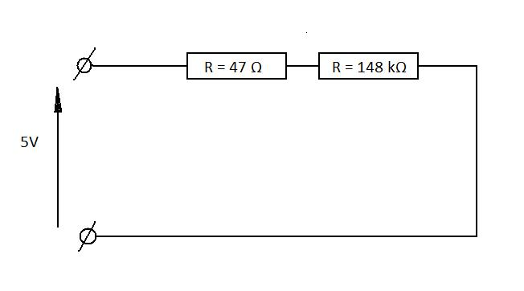
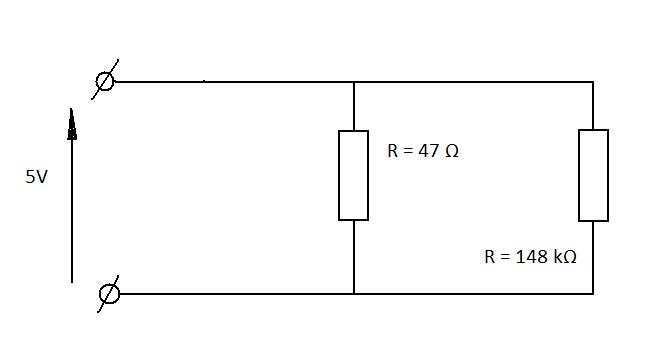
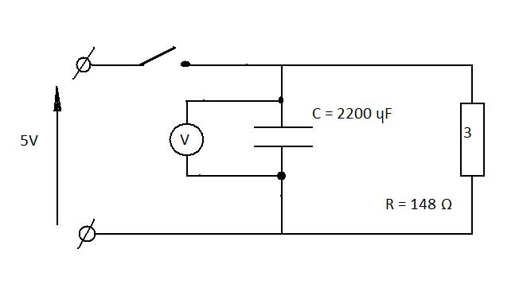

#Getting comfortable

This first lesson will show how to make very simple circuits as well as measure the voltage, current and resistance.

We will start with basics and it will get harder as we will go along.

##Making measurements

To make measurements you will require multimeter, the one we are using is shown below

{@class=centre}

The provided manual should give a brief explanations on how to operate your multimeter. 

###Measuring voltage

To measure voltage the clips should be placed in parallel with the component that is to be measured. To find a voltage across resistor R the voltmeter should be placed as shown in picture.

{@class=centre}

The reason voltmeter should be placed in parallel with the measured component is that the voltage remains the same in all components that are connected in parallel.

###Measuring current

While the voltage is the same across all parallel components, the current isn't. However the current is the same in all components that are connected in series. Imagine current as flowing water. The ammount of water that flows inside the component will remain unchanged on its way out. 

Therefore the current measuring device - ampermeter, has to be placed in series with the component that is to be measured. Circuit below shows how ampermeter should be integrated into the circuit.

{@class=centre}

##Simple electrical circuits

We will start with very simply circuit that is shown below

{@class=centre}

To make this circuit you will require

 + 47 Ohms resistor (any value will do)
 + 5V voltage source
 + Multimeter
	
Now try to connect this circuit, and measure the voltage across the resistor.
	
Now try to perform a simple calculations and prove that measured voltage is the same as calculated. (Hint: use Ohm's Law)
	
Now lets try to connect two resistors in series. You will require same equipment as before plus
	
 + 148 kOhms Resistor
	
consider the circuit below

{@class=centre}

Now using Ohm's Law calculate voltages across both resistors. You can use potential divider or just remember the fact that current remains the same in all components that are connected in series.

If you performed your calculations correctly you should get $V_1=4.99 V$ and $V_2=1.6 mV$ (these values are valid only for these resistors)

Now try to verify your calculations by measurement.

Next circuit will give an understanding of total resistance when resistors are connected in parallel.

{@class=centre}

This time we know that voltage across parallel components is the same. Verify it by connecting circuit above and measuring voltage of both resistors.

We know that current will not be the same in parallel components. First try to calculate the expected current value through every resistor.

This is the values you should obtain: $I_1=106 mA$ and $I_2=0.034 mA$

Now try to integrate your ampermeter into the circuit and verify your results.

The next circuit will contain resistors in parallel and in series. Consider circuit bellow and try to find voltage and current passing through every resistor, then verify your results with measurements.

{@class=centre}

if you used components that are shown in the picture above you should obtain the folowing values:

$I_1=60 mA$  $V_1=2.84 V$ $I_2=45 mA$  $V_2=2.15 V$ $I_3=14 mA$  $V_3=2.15 V$

##RC - circuits

RC circuits involves two components - resistors (R) and capacitors (C)

The math that is involved calculating resistance, voltage and current is more complicated than the one we used previously and therefore will not be considered in this lesson. We will show the effect of having capacitors in the circuit. Also we will observe their behaviour when connected to the voltage supply.

Build the following circuit, and connect your voltmeter across the capacitor.

{@class=centre}

You will need:

 + 2.2 mF Capacitor (any value will do but the bigger the better)
 + 147 k\gama Resistor
 + Voltmeter
 + Switch
	
Put switch to "on" position and observe the voltmeter. It should show the same voltage as your source. Now put switch into "off" position and observe your voltmeter.

Have you noticed that voltage "died" gradually. Try to replace resistor with higher resistance, and you notice that this time capacitor "dies" even slower.

When the switch was on, the voltage charged capacitor and when it was put to "off" position capacitor discharged its charge through resistor. The bigger resistance the slower discharge rate.

If you feel comfortable with everything that is described in this lesson you should follow to [next lesson](lesson2.html) 
