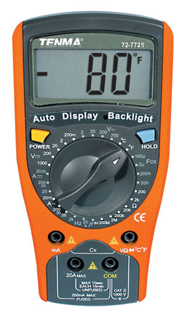

Getting comfortable
===================

What you'll be learning
-----------------------
You'll go through several exercises, and by the end, you should:

+ Know how to use a digital multimeter to measure current and voltage
+ Understand [Ohm's Law](ohm.html)
+ Understand [Kirchoff's laws](kirchoffs.html)
+ Know what a resistor is, and how they behave if wired in parallel or in series
+ Know what a capacitor is, and how they behave if wired in parallel or in series
+ Understand capacitor charging and decay
+ Be able to work out the time constant of a capacitor-resistor (CR) circuit.
+ Be able to create a circuit on a breadboard from the circuit diagram.

What you'll need
----------------
While everything is explained, and you will pick up a lot by simply reading, you will pick up a lot more if you try all the exercises without peeking ahead at the answers. To do this, you will need a few tools and components to complete them. These are:

+ A digital [multimeter](using_multimeter.html)[^2]
+ A [breadboard](breadboard.html)
+ A 9 volt battery (Such as an 6LR61 or a regulated power supply set to 9 Volts)
+ A bunch of [resistors](resistor.html) and [capacitors](capacitor.html)[^1] 
+ It might be nice if you have a proper switch, but, you can always use two bits of wire that you touch together instead! 

If you've already equiped yourself with [the basics](components_basic.html), then you're sorted!

Introduction to the digital Multimeter
--------------------------------------
A digital multimeter will be a vital tool as you beging to explore electronics. For the moment, you'll only need it to measure current and voltage. The [TENMA 72-7725](http://uk.farnell.com/tenma/72-7725/multimeter-digital/dp/7430582) multimeter is the one we'll be using for our demos. 

It's a manual-range multimeter (which means that you select the range of values that can be displayed manually) that can measure both alternating and direct current and voltage as well as capacitance, resistance, and temperature. In fact, even though the temperature probe is not plugged in, you can see the dial in the picture is set to measuring temperature in degree Fahrenheit. Most digital mutlimeters are pretty much the same, but can have some important differences. Make sure you refer to the manual that came with the one you'll be using. If you have a multimeter, but don't have a user's manual for it, have a look at the [farnell website](http://www.farnell.com/) for your meter and they might have the manual you need. To save you the trouble, we've got a copy of the [72-7725 manual](../resources/multimeter-manual.pdf). 

Resistor Circuits
-----------------
[Resistors](resistor.html) are some of the most common components in electric circuit. They oppose the flow of current in a circuit. You can find out the resistance of a resistor by looking at the little bands of color that are painted on it. Have a look at [The Resistor Color Code](resistor.html#colorcode) to learn how to decipher the colors. Don't worry about not remembering them. We have to look it up every time! The resistance indicates how strongly the resistor opposes current flow. We measure it in Ohms in honour of [Georg Ohm](http://en.wikipedia.org/wiki/Georg_Ohm).

###Exercise 1 (Remembering Ohm's law)
Setup your breadboard as shown below using one resistors. We recommend you use large resistors (In our case we use 100 Ohm resistors.)

Which is in fact the following cicuit.

Now, switch your multimeter to measuring voltage (with the appropriate range. We've used 20V) and connect the leads on either side of the resistor. 

{@class=question} What does your multimeter show?

{@class=answer} You should find that the voltmeter displays around 9V

{@class=question} Try reversing the leads. What does your voltmeter show now?

{@class=answer} The value should now be around -9V. This is interesting, because it shows us that what we are actually measuring is a _relative difference_ in voltage. This will become important as our circuits get more complex

Now that we know the Voltage and the Resistance, we can calculate The Current according to [Ohm's law](ohm.html). (For those who have forgotten, current is a measure of the flow rate of charge, measured in Amp&egrave;re in units of Coulombs per second.) Using

$$I=\frac{V}{R}$$

And the known voltage and resistance (from the rating on the resistor) We can work out that the current through the resistor is 0.09 Amp&egrave;res. (or $90mA$). Now, this might seem very small, but in fact, one Ampere is a very large current, and besides the need for specially designed circuits to deal with the heat generated, large currents are very dangerous, and could easily cause serious injury or death. Which is why in this course, we'll only deal with small currents.

We can verify our calculations by checking the current actually going through the circuit using our multimeter. Switch your multimeter to current measurment and connect one lead to the resistor and the other lead in series to the battery. Remove the connection between the resistor and the battery as shown below:

{@class=question} Does your measument match your calculated value? How closely? Is it bigger? Smaller? Can you explain why?

{@class=answer} You'll find that the measured value is smaller than the calculated value. That is because the total resistance of the circuit is greater than the resistance given on the resistor. In fact, every component in the circuit has a resistance, including the ammeter. We don't take them into account because they're very small in comparison to the resistance of the resistor, but you should remember this for later. The resistance of a battery or a power source is called the _internal resistance_ and can be measured like any other. Even the wires have a small resistance.

###Exercise 2 (Resistors in series)
Now, Add another 100 Ohm resistor in series into your circuit as shown below.

Once you have set up this circuit, use your multimeter to answer the following questions:

{@class=question} What is the voltage across both resistors? 

{@class=answer} You should see that the voltage across both resistors remains the same as before.

{@class=question} What is the voltage across each resistor? Can you see why this is?

{@class=answer} The voltage across each resistor should be the same and around 4.5V.

Now, we can use Ohm's law to calculate the current through each resistor. Remembering that $V=IR$, calculate the current across each resistor. 

{@class=question} Does this agree with measurement using your multimeter?

{@class=answer} The current through the resitors should be around 4.5mA.

The value for the voltage an the current can be understood if we consider the water analogy. In the water analogy, the Voltage is taken to be the pressure of the water, while the current is the flow rate. In the case of two resistors in series, the water cannot branch off through another path, therefore, since we have a closed circuit, the flow rate must remain constant and be the same through both resistors. However, The pressure will progressively drop due to drag. This mirrors exactly what the voltage will do.

{@class=question} Relative to 0, what is the voltage at the junction between the resistors?

{@class=answer} It will be 4.5V.

{@class=question} If the two resistor are considered as a single unit, what is the resistance of the unit?

{@class=answer} The resistance of the unit is the sum of the resistor's resistance. ie: **Resistance is additive in series**. For a number N of resistors in series, the total resistance is thus:
$$R_{total}=R_1+R_2+\ldots+R_N$$

This is actually a special case of a _potential divider_. A potential divider takes in a particular voltage, and spilts it to a given value. It can more easily be shown in a diagram:

There's several new features here, so let's go through them. Firstly, you'll notice that this diagram lacks the symbol for a battery. Instead, we have what are called rails. These are the terminals labeled with a voltage. We use rails instead of batteries because in practise, it matters little if our circuit is driven from a battery or from a power pack. In the diagram, we have a nine volt and a zero volt rail, which would be equivalent to a 9 volt battery. Secondly, the ground rail is _grounded_. This is represented by the symbol made of three parallel horizontal lines, and means that the 0V rail is attached to the earth in some way. The earth acts as a very large current sink, and effectively has a voltage of 0V. 

{@class=warning}The earth from a mains cable is not suitable for this purpose. It is very dangerous to use household mains earth. If the installation or an appliance has a fault, you risk electrocution. In some cases, household earth is connected to your water pipe, and even if your own installation is perfect, the earth wire may carry a current from your neighbour's faulty installation! Most small electronics project _will not_ need to be earthed, and the 0V rail is suitably provided by a battery. An ideal earth is a large metal spike planted into the ground away from electrical cabling. A large metal desk will also work well for small battery-powered electronics project during testing should they really need to be earthed.

{@class=question} How is $V_{out}$ governed by the values of R1 and R2? 

{@class=answer} The voltage of Vout is governed by the values of R1 and R2 by the following equation.
$$V_{out}=\frac{R_2}{R_1+R_2}\cdot V_{in}$$ 
To arrive at this, we start by using Ohm's law to see that
$$V_{in}=(R_1+R_2)\cdot I_l$$
Which we re-arrange for $I_l$ and substitute into another statement of Ohm's law
$$V_{out}=\frac{I_l}{R_2}$$
to give us our solution.

{@class=question} If  

###Exercise 3

What we see here is an application of [Ohm's law](ohm.html) and [Kirchoff's current law](kirchoff.html). We already encountered Ohm's law in Exercise one. Kirchoff's current law 

Replace one of the 100 Ohm resistors by a 47 Ohm resistor. 

What is the voltage across the 100 Ohm resistor now?
What is the voltage across the 47 Ohm resistor now?

Potential dividers

Can you now work out the internal resistance of your battery? Hint: Consider a potential divider containing a 

Capacitor Circuits
------------------
time constant

What you've learnt
------------------

Learning more on your own
-------------------------
We recommend a good browse through wikipedia for a bit more background info on Ohm's and Kirchoff's laws.

*************************************************************************

###Measuring voltage

To measure voltage the clips should be placed in parallel with the component that is to be measured. To find a voltage across resistor R the voltmeter should be placed as shown in picture.

{@class=centre}

The reason voltmeter should be placed in parallel with the measured component is that the voltage remains the same in all components that are connected in parallel.

###Measuring current

While the voltage is the same across all parallel components, the current isn't. However the current is the same in all components that are connected in series. Imagine current as flowing water. The ammount of water that flows inside the component will remain unchanged on its way out. 

Therefore the current measuring device - ampermeter, has to be placed in series with the component that is to be measured. Circuit below shows how ampermeter should be integrated into the circuit.

##Simple electrical circuits

We will start with very simply circuit that is shown below

To make this circuit you will require

 + 47 Ohms resistor (any value will do)
 + 5V voltage source
 + Multimeter
    
Now try to connect this circuit, and measure the voltage across the resistor.
    
Now try to perform a simple calculations and prove that measured voltage is the same as calculated. (Hint: use Ohm's Law)
    
Now lets try to connect two resistors in series. You will require same equipment as before plus
    
 + 148 kOhms Resistor
    
consider the circuit below

{@class=centre}

Now using Ohm's Law calculate voltages across both resistors. You can use potential divider or just remember the fact that current remains the same in all components that are connected in series.

If you performed your calculations correctly you should get $V_1=4.99 V$ and $V_2=1.6 mV$ (these values are valid only for these resistors)

Now try to verify your calculations by measurement.

Next circuit will give an understanding of total resistance when resistors are connected in parallel.

This time we know that voltage across parallel components is the same. Verify it by connecting circuit above and measuring voltage of both resistors.

We know that current will not be the same in parallel components. First try to calculate the expected current value through every resistor.

This is the values you should obtain: $I_1=106 mA$ and $I_2=0.034 mA$

Now try to integrate your ampermeter into the circuit and verify your results.

The next circuit will contain resistors in parallel and in series. Consider circuit bellow and try to find voltage and current passing through every resistor, then verify your results with measurements.

{@class=centre}

if you used components that are shown in the picture above you should obtain the folowing values:

$I_1=60 mA$  $V_1=2.84 V$ $I_2=45 mA$  $V_2=2.15 V$ $I_3=14 mA$  $V_3=2.15 V$

##RC - circuits

RC circuits involves two components - resistors (R) and capacitors (C)

The math that is involved calculating resistance, voltage and current is more complicated than the one we used previously and therefore will not be considered in this lesson. We will show the effect of having capacitors in the circuit. Also we will observe their behaviour when connected to the voltage supply.

Build the following circuit, and connect your voltmeter across the capacitor.

{@class=centre}

You will need:

 + 2.2 mF Capacitor (any value will do but the bigger the better)
 + 147 kOhms Resistor
 + Voltmeter
 + Switch
    
Put switch to "on" position and observe the voltmeter. It should show the same voltage as your source. Now put switch into "off" position and observe your voltmeter.

Have you noticed that voltage "died" gradually. Try to replace resistor with higher resistance, and you notice that this time capacitor "dies" even slower.

When the switch was on, the voltage charged capacitor and when it was put to "off" position capacitor discharged its charge through resistor. The bigger resistance the slower discharge rate.

If you feel comfortable with everything that is described in this lesson you should follow to [next lesson](lesson2.html) 

{@class=centre}
previous lesson | [Home](index.html) | [next lesson](lesson2.html)

[^1]: While the specific values aren't really important to understand the concepts, the solution to the exercises are written for them. With that in mind, we recommend: three 100 Ohms resistor, two 47k Ohms resistor, three 47 microfarads capacitor and a 2200 microfarads capacitor
[^2]: Since we're just going to be using voltage and current measurment, you could easily substitute for a Voltmeter and a an Ammeter!
