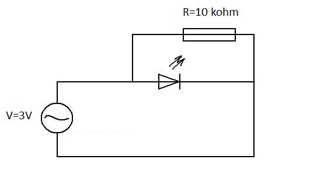
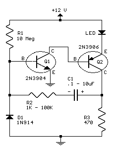
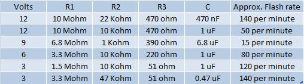
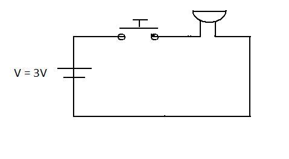
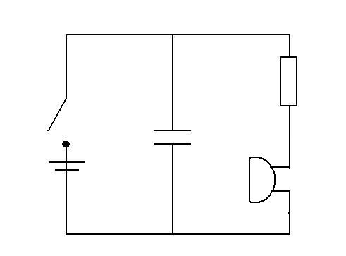
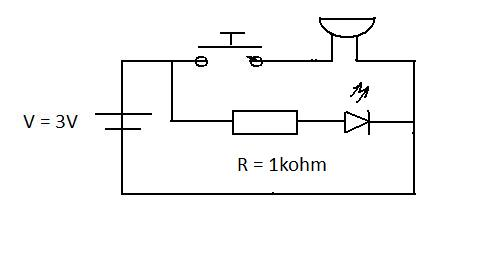
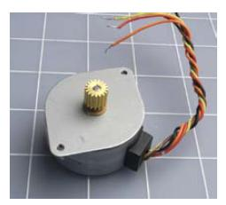
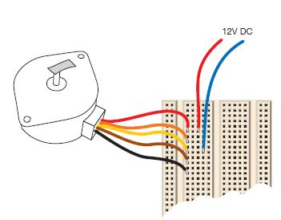
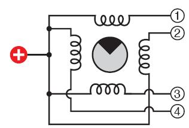

#Fun with LEDs
##What you'll learn
+ Build a circuit that emits a light through LED
+ Build a circuit that flashes using just LED and RC components
+ Build a circuit that produces a sound through a buzzer
+ Build a liitle device that will make a sound with variable frequency
+ Build a circuit that shows electric motor in action

##What you'll need
+ 2 LEDs - red and yellow
+ 2 capacitors polirised 1uF and 2.2mF
+ 1 PNP [transistor](pnpresistor)
+ 1 NPN [transistor](NPNresistor)
+ 4 resistors (470 Ohm, 5kohm, 10kohm, 10 Mohm) 
+ Stepper motor: Unipolar, four-phase, 12-volt. Parallax 27964 or similar.

##Circuit simulation

Most of the circuits used in this lesson will have a link into applet, which will simulate the circuit. You are free to play arround with it by changing some values and observing the behaviour. This applet will allow you to simulate circuits and can be very useful if you will decide to build your own and want to test it by building a theoretical model.

The link to this applet can be found [here](http://www.falstad.com/circuit/).

##LED circuits

To observe Light Emitting Diode in action you will build a very basic electric circuit that will show the use of LEDs. First build a circuit that is shown below:

 

Once connected to the 5 V battery [LED](led.html) emits photons that can be detected by your eye. But if you remeber it was mentioned that LED is just a specific type of a [Diode](diode.html). To explore its properties as a diode you will be required to build a following circuit. 

The simulated circuit can be found [here](APPLET).

{@class=question} What is the maximum current that can flow through standart red LED before it burns?

{@class=answer} 30 mA or arround 1.7-2.0 V 

{@class=question} What is the maximum voltage that can be applied to the circuit above with resistor values R = 470 ohm ?

{@class=answer} $$R=(V_{s}-V_{L})/I$$  
rearrangin this equation for $$V_{s}$$ gives us: 
$$V_{s}=I(R+\frac{V_{L}}{I})$$ 
 $$V_{s}=0.03(470+\frac{2}{0.03})=16.1 V$$ 
where $$V_{s} and V_{L}$$  are supply voltage and threshold voltage of LED respectively. 

The circuit below will combine two properties of LED - as a diode and as light emmiter. Build the circuit bellow.

To observe the properties of a diode let's connect it to 3 V battery or DC signal generator. You will notice that only one of the LEDs emits light. Now let's flick the switch. You probably have noticed that now the LED that was emitting light before now is switched off, while the other one is on.(

The same circuit was built in applet to show its theoretical behaviour. The switch was used as a tool that would change the polarity of a battery. The simulated circuit can be found [here](APPLET).

{@class=question} Would you still observe light if DC power supply swapped with AC ? Prove it by simulating this circuit in applet.

{@class=answer} Yes. You would notice both LEDs flashing if the frequency is low enough (~2HZ). Also remember to add resistors to avoid damaging LEDs. The applet simulation can be found [here](appletsimulation). 

If you managed to build this circuit in applet there should be nothing that would stop you from building this circuit in reality. The diagram is shown bellow. Try to replicate it and connect to AC power source with very small frequency.

The circuit above connected to a low frequency AC signal generator (NOTE: the battery is not suitable as it produces DC voltage). If the frequency is low enough (try 0.1 Hz and increase it gradually to 10 Hz) LED should be flashing. If the frequency is increased the flash rate will increase too. Now try to generate a signal with a frequency of 50 Hz. It appears that LED is lit up constantly, but that's not exactly correct. LED is still flashing, just the frequency is too high for human eye to notice.

###RC and LED circuits

Now we will introduce a [Capacitor](capacitor.html) to show the effect of delayed flash. It is known that capacitor can store a charge which can be released through resistor. Build the following circuit to observe its behaviour. (Tip: switch circuit on and off and observe the behaviour of LED)

From the circuit above it can be seen that when the switch is on it charges the capacitor as well as emits light through LED. But when the switch is switched off, LED doesn't die straight away. It still keeps emitting light after some time after the circuit was unplugged. 

Every RC circuit (circuits that are made of resistors and capacitors) has a time constant. This time constant determines the time that takes the capacitor to discharge to 37% of its initial voltage. 
Now let's change the resistor with the one that has R=OHMS Ohms. Switch circuit on for a few seconds and then switch it off. 

Have you noticed that the time it took for LED to die was much longer than using resistor with smaller resistance? The [water analogy](water_analogy.html) would be straight forward. Imagine having a tank full of water with a plug that would have some sort of mechanical resistance. It is quite obvious that the bigger resistance the more time required for the tank to empty. 

When the switch is on the capacitor is beeing charged. But when the switch is put to off position the capacitor acts as a power source and discharge its charge through resistor and LED. That's why we see this delay.

The circuit simulation for this particular circuit can be found [here](Applet).

For the next circuit you will require to familiarise yourself with the basic principles of [transistors](transistor.html). The transistors we will be using are bipolar PNP and NPN and the main purpose for it just to act as an electronic switch. 

An example with flashing LED required AC voltage with variable frequency in order to observe these flashes. Using a combination of transistor and capacitor we can build a circuit that will make LED flash even using a direct current (DC). Build the circuit that is shown below. 

Note the position of capacitor and transistors. If you will be using transistors that are shown in the diagram below take extra care connected them. The fact sheets for the transistors used in this circuit can be found [here](factsheets).

#NEEDS explanation how everything works.

Once this circuit is connected to 12 V battery you can see that LED flashes. The rate can be defined by changing resistances as well as capacitance of capacitor. The following table has a few examples for you to try out. 

##Buzzer circuits

Now let's play with the sound. You will require a buzzer and a push switch. Try to connect the circuit below.

When the switch pushed you can hear the sound. The use of this circuit is quite obvious - just fit it in the small box, connect a battery and mount it on your doors. That's a perfect door bell. 

We can build similar circuits to those used previously with LEDs and just adjust the resistor values and swap LED with a buzzer. Build a following circuit to explore behaviour of a buzzer connected with capacitor.

Press the switch, you will hear sound, but even after releasing the switch, the sound still can be heard. Similarly playing with the circuits that were used for LEDs we can make the ones that have buzzers instead. 

Combining LED and buzzer in one circuit can be very fun. Try to build a following circuit and explore its behaviour.

This circuit makes sound when the pushswitch is pressed. When switch is released all current goes to the other branch and you can observe the light that is emmited through LED. 

##Electric motor circuits

Now let's move on from the light and sound to the movement. [Electric motor](http://en.wikipedia.org/wiki/Electric_motor) is a device that converts electric energy to mechanical energy. The flowing charge experiences a force if placed in magnetic field. We will build a few circuits that will allow you to play with the electric motors. Then we will integrate them in the circuits that were built previously and explore applications where such a circuits could be used.

A unipolar, four-phase, 12 V motor was specified because it is a very common type. A picture of typical motor is shown below.

If you are unable to find this specific type of motor, any other with similar specification will be as useful. "Unipolar" means that you don't have to swotch the power supply from positive to negative and then again to positive to run the motor. Four-phase means that the pulses that run the motor must be applied in sequence to four separate wires.

We will start with very basic circuit that will show electric motor in action. The motor will be connected to the power supply directly to explore its behaviour. Most likely the motor will have five wires which are already stripped and are ready to be inserted into holes of the breadboard. Connect the motor as shown in the picture bellow.

Chech the data sheet for your motor; you should find that four of the wires are used to supply power power to the motor and turn it in steps, while the fifth wire is known as common connection. This common connection should be connected to the positive side of the power supply, while the negative voltage is applied to the other four wires. If you are using the motor specified previously the data sheet can be found [here](../resources/motor.pdf).

The data sheet will tell you in what sequence the voltage should be applied to the wires. This can be figured out by trial and error, but remember to apply the correct voltage to prevent damaging the motor.

To see what motor is doing attach the duct tape to the end of the shaft. Then apply voltage to wires, one at a time, by moving negative wire from one wire to the other. You should observe shaft turning in little steps.

Inside the motor are coils and magnets, but they function differently from those that are in DC motor. The simplyfied configuration of the stepper motor is shown in the picture below.

Every time power is applied to the wire a certain coil is activated and move the motor by one step. This simplyfied model is good enough to get rough idea of whats going on inside this motor. The more detailed explanation whats going on inside stepper motor can be found [MOTOR LINK + EXPLANATION](motor).

{@class=warning}Do not leave battery connected to the motors if you do not intend to drive it. Stepper motors, unlike the DC motors, uses power even, when they are switched off. If the battery is left - the charge wount last too long!

In the next lesson we will talk about the circuits that are used to "sense the universe". We will be using the surrounding as a trigger that will switch on or off our circuits. Now when you know all the basics of circuits that can produce an output in a form of light, sound and movement, you can move to the [next lesson](lesson3.html) to sense the universe.

