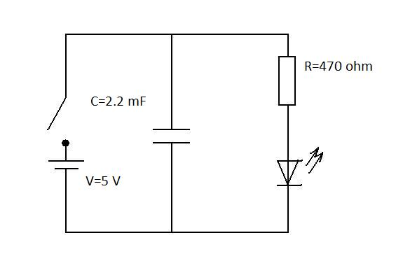
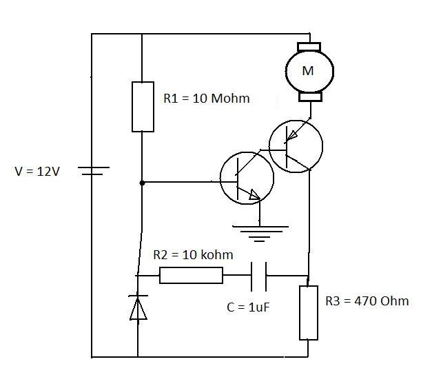

#Fun with LEDs
##What you'll learn
+ Build a circuit that emits a light through LED
+ Build a circuit that flashes using just LED and RC components
+ Build a circuit that produces a sound through a buzzer
+ Build a liitle device that will make a sound with variable frequency
+ Build a circuit that shows electric motor in action

##What you'll need
+ 1 LED (any color)
+ 1 capacitor 1uF
+ 1 PNP resistor
+ 1 NPN resistor
+ 5 resistors (1 M$\Omega$ OTHER VALUES) 

##LED circuits

To observe Light Emiting Diode in action you will build a very basic electric circuit that will show the use of LEDs. First build a circuit that is shown below:

Once connected to the VOLTAGE V batery [LED](led.html) emmits photons that can be detected by the eye. But if you remmeber it was mentioned that LED is just a specific type of a [Diode](diode.html). To explore its properties as a diode you will require to build a folowing circuit.

To observe the properties of a diode let's connect it to 3 V batery or DC signal generator. You will notice that only one of the LEDs emmits light. Now let's reverse the polarity of your batery or signal generator. You probably have noticed that now the LED that was emiting light before now is switched off, while the other one is on.

The circuit above connected to a low frequency AC siganl generator (NOTE: the batery is not suitable as it produces DC voltage). If the frequency is low enough LED should be flashing. If the frequency is increased the flash rate will increase too. Now try to generate a signal with a frequency of FREQUENCY Hz. It appears that LEDs is lit up constantly, but thats not exactly correct. LED is still flashing, just the frequency is too high for humans eye to detect this flash.

Now we will introduce a [Capacitor](capacitor.html) to show the effect of delayed flash. It is known that capacitor can store a charge which can be reliesed through resistor. Build the folowing circuit to observe its behaviour. (Tip: switch circuit on and off and observe the behaviour of LED)

### Check values above

From the circuit above it can be seen that when the switch is on it charges the capacitor as well as emits light through LED. But when the switch is switched off, LED doesn't die straight away. It still keeps emiting light after some time after the circuit was unpluged. Now lets change the resistor with the one that has R=OHMS Ohms. Switch circuit on for a few seconds and then switch it off. 

Have you noticed that the time it took for LED to die was much longer than using resistor with smaller resistance. The [water analogy](water_analogy.html) would be straight forward. Imagine having a tank full of water with a plug that would have some sort of mechanical resistance. It is quite obvious that the bigger resistance the more time required for the tank to empty. 

For the next circuit you will require to familirise yourself with the basic principles of [transistors](transistor.html). The transistors we will be using are bipolar PNP and NPN and the main purpose for it just to act as an electronic switch. 

An example with flashin LED required AC voltage with variable frequency in order to observe these flashes. Using a combination of transistor and capacitor we can build a circuit that will make LED flash even using a direct current (DC). Build the circuit that is shown below.

Once this circuit is connected to VOLTS V batery you can see that LED flashes. The rate can be defined by changing resistances as well as capacitance of capacitor. The folowing table has a few examples for you to try out. 

##Buzzer circuits

Now lets play with the sound. You will require a buzzer and a push switch. Try to connect the circuit below.

When the switch pushed you can hear the sound. The use if this circuit is quite obvious - just fit it in the small box, connect a batery and mount it on your doors. That's a perfect door bell. 

We can build similar circuits to those used previously with LEDs and just adjust the resistor values and swap LED with a buzzer. Build a folowing circuit to explore behaviour of a buzzer connected with capacitor.

PICTURE 7 (capacitor decay with high resistance) PIC3

Press the switch, you will hear sound, but even after releasing the switch, the sound still can be heard. Similary playing with the circuits that were used for LEDs we can make the ones that have buzzers instead. 

Combining LED and buzzer in one circuit can be very fun. Try to build a folowing circuit and explore its behaviour.

#CHECK THE VALUES for above picture

##Electric motor circuits

Now let's move on from the light and sound to the movement. [Electric motor](http://en.wikipedia.org/wiki/Electric_motor) is a device that converts electric energy to mechanical energy. The flowing charge experience a force if placed in magnetic field. We will build a few circuits that will allow you to play with the electric motors. Then we will integrate them in the circuits that were built previously and explore aplications where such a circuits could be used.

We will start with very basic circuit that will show electric motor in action.

When switch is on you can notice that the motor starts to raotate. You could increaese the voltage and observe the speed of rotation of the motor. NOTE Do not put very high voltages as it can permanently damage the motor. 

Now lets consider a circuit that we used to flash our LED. and replace LED with a motor. The diagram for this circuit is provided below.

When the swith is put to on position we can see that motor switches itself on and of at a constant rate of time. 

In the next lesson we will talk about the circuits that are used to "sense the universe". We will be using the surrounding as a trigger that will switch on or off our circuits. Now when you know all the basics of circuits that can produce an output in a form of light, sound and movement, you can move to the [next lesson](lesson3.html) to sense the universe.

