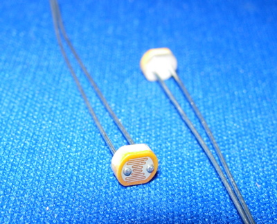

Sensing your world
==================

What You'll be learning
------------------------
We'll learn how to build potential dividers with thermistors, LDRs and mircophones, and how to use these to control a signal. We'll walk you though building some simple devices that use these sensors and the circuits shown in [lesson 2](lesson2.html), like a bath temperature sensor, or a safety light that turns on when it gets dark.

What You'll need
----------------

 + A Light Dependent Resitor (LDR)
 + A 10 kOhm resistor
 + A 100 Ohm resitor
 + Your multimeter
 + A thermistor
 + A Relay (optional)
 + An Oscilloscope (optional)

Getting acquainted with senseors
--------------------------------
An electronic gadget, on its own, isn't actually very useful. It only becomes useful when it can interact with its environment in some way. In the previous lesson, we learnt how to control LEDs in various fashions, as well as using simple circuits to produce tones and sounds, in other words, things that can affect the environment. In order to make useful circuits, We also need them to be able to sense the environment too.

There's many different ways in which a circuit can gather information from its environment. We'll be looking at three particular sensors: The [Light Dependent Resistor (LDR)](ldr_thermistor.html), the microphone, and the [Thermistor](ldr_thermistor.html).

### The LDR

The Light Dependent Resistor (LDR)'s resistance changes with respect to the light level. When light shines on an LDR, its resistance drops dramatically. It can help to think of an LDR as a light activated transistor, with the base of the transistor as the light absorbing surface. (This is in fact how many LDRs work.)

Lte's try and figure out how the resistance changes with light. Build the circuit shown below and set your multimeter to measure voltage, and measure the voltage across the LDR when the LDR is lit and when it is in the dark. Most LDRs will be reasonably sensitive, and normal daylight will count as "light". Cover the LDR with your thumb when you want to test dark conditions.

{@class=question} What is the resistance of the LDR when it is light? Hint: Remember Ohm's law

{@class=answer} Every LDR will be different, But we can remember how to calculate the output voltage of a potential divider using the formula below:
    $$V_{out}=\frac{R_{bottom}}{R_{top}+R_{bottom}}$$
Now, some simple rearanging gives us:
    $$R_{bottom}=\frac{R_{top}}{1-V_{out}}\times V_{out}$$
Does your answer make sense? The LDR we're using has a resistance while dark 

{@class=question} Is this a darkness sensor, or a light sensor?

{@class=answer} This is a darkness sensor. As the light level decreases, the resistance of the LDR increases, which means that it will draw more voltage from the power source. We could say that $V_{out}$ Of course, the "lit" and "dark" $V_{out}$ of this system will depend strongly on the value of the fixed resistor. If we were using this circuit in a real application, we might want to substitute the fixed resistor with a variable resistor, so that we can tune the voltage under different conditions.

### The microphone(s)

Microphones are sensors that turn a sound signal into an electrical signal representing the sound. There are a wide variety of microphones, and the [wikipedia page](http://en.wikipedia.org/wiki/Microphone) will give you a good idea of what the different types are. While the way the operate is not the same for all microphones, they are all used in roughly the same way. In fact, we can even use an ordinary earphone as a microphone!

Try to connect the microphone to an Oscilloscope as shown below:

Now make some noise!

{@class=question} What do you see on your screen? 

{@class=question} Wh

### The Thermistor

A simple darkness activated safety light
----------------------------------------

A bath temperature sensor
-------------------------

A sound level monitor
---------------------
