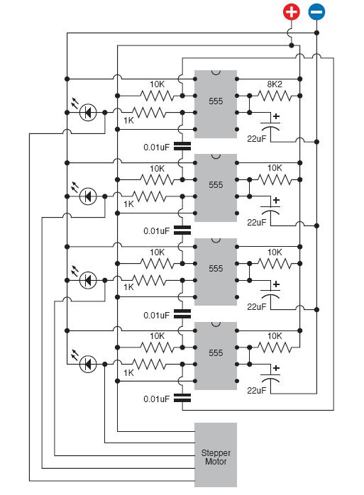
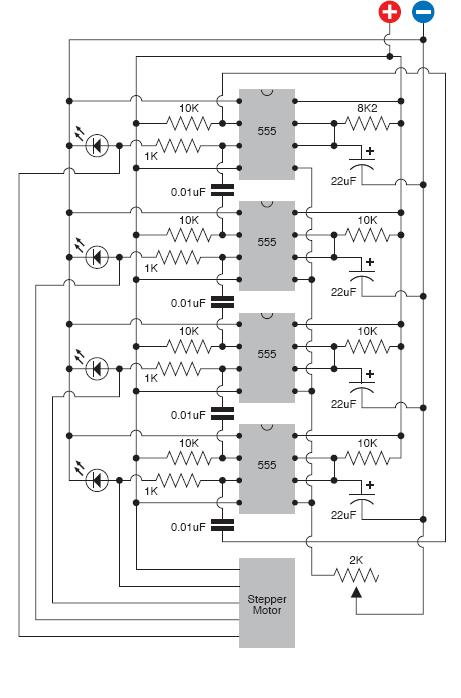
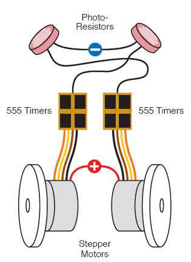

# A Light Following Robot

This lesson will be slightly different from the previous three. In this lesson we will try to build a light following robot. This lesson will tell you everything that you will need to get started, but it woun't go all the way in exhaustive detail. 

This type of approach will let you to take part in the actual process, where you will be able to improve on the plans and eventually learn how to invent things yourself.

##What you'll need

+ 555 timers. Quantity 8
+ Trimmer potentiometer, 2K linear. Quantity: 2.
+ LEDs. Quantity: 4.
+ Stepper motor: Unipolar, four-phase, 12-volt. Parallax 27964 or similar, consuming 100mA maximum. Quantity: 2.
+ Photoresistors, ideally 500 to 3,000? range. Quantity: 2.
+ ULN2001A or ULN2003A Darlington arrays by STMicroelectronics. Quantity: 2.
+ CMOS octal or decade counter. Quantity: 2.
+ Various resistors and capacitors.

A lot of these components are new to you. But we will explain what every component does and how it should be used. 

There was an attempt to explain how stepper motor works in [lesson 2 - fun with LEDs](lesson2.html). Go back and revise if you feel that you need, once revised we can move to the next step. 

In the lesson 2 we showed you how to test the motor, now we will explain how to drive it. It was discussed previously that motor is driven by sending a pulse to each of the four wires in turn. For a quick and simple demonstration we will use [FIND LINK 555 timers](555 timers). 

But first we will introduce you to the 555 timers.

## 555 Timers 

Now when you comfortable with these timers we will go back to our original demo on driving motors. Connect the folowing circuit. It looks more complex than it really is. Each timer has the same pattern arround it, so when the make the first one, and then repeat same procedures to obtain another 3.

We've used 10kohm resistor to pull up the input to each 555, so that timers are naturally in their quiescent state. The 0.01 uF capacitor links the output of the one timer to the input of another providing electrical isolation from each other. This capacitor produces a "spike" of voltage when first timer is finished, and it triggers the next. 

The LEDs are included just to give some visual effect, so you will know what is happening. If you would make a wiring mistake your motor may turn to and fro erratically, and you won't know why. Initially run this circuit with LEDs only, and make sure that you get the expected response.

{@class=question} What behaviour did you observe ?

{@class=answer} Assuming that all you wiring was done correctly you should observe all 4 LEDs lightning up in turn. Something similarly to the runway in the airport.

Now add the motor by plugging its wires into the breadboard, where you'll make connections to the outputs (pins 3) of the timers.

Apply the power, and you should see motors turning in steps along with LEDs. 

{@class=warning} If LED sequence isn't stable:
 + Connect the wire directly from the input (pin 2) of the topmost timer to positive side of the voltage supply, and wait for the timers to calm down.
 + Restart the sequence by disconnecting the free end of this wire, or touch the free end of it briefly to the negative side of the supply, to trigger the first timer. 

You probably have noticed that one pin of the 555 timers has been left unused. Normally. pin 5 should be grounded through a capacitor to prevent it from picking up stray voltages which can affect the accuracy of the chip.

This pin was left on purpose. Because we want to be able to change the timing of our 555s. To do that, you will have to tie pin 5 of all four timers as show in the picture bellow and put variable resistor between them and the negative side of the power supply. 

Now explore what happens to the LEDs when the resistance of the varriable resistor reduces.

{@class=question} When resistance drops bellow ~150 ohms the LEDs go dark. Why is that ?

{@class=answer} When the resistance drops bellow 150 ohms, the voltage on pin 5 is reduced bellow threshold level that the 555 timer finds acceptable.

Now as you observed 555 timers in action, and learned how to control them, we will go one step further. If we want to run our motors the speed has to be increased. To do that simply change the 22uF capacitors with a 4.7 uF or smaller. Now adjust the varriable resistor, and you should be getting useful range of speed.

## Make it controlled by environment

At the moment circuit is totally depends on your chosen values, nad it does exactly what you tell it to do. But let's make make its own decisions. In other words let's make this circuit to be controlled by the surrounding environment, or in our case - light.

To that we will require [NEED A LINK HERE Light Depending Resistor]{LDR}. We could substitute photoresistor instead of varriable resistor. 

We will remind you that our initial object was to build a robot that is attracted to light. The idea of this is very simple. Substituting varriable resistors with photoresistors, will make speed of motors dependant on the light.

Ig the left motor is controlled by a photoresistor placed in the right side, and right motor with a resistor in the left, then when light shines from the left, will reduce the resistance of the right motor that would caouse left motor to rotate faster than the right. And hence robot will be turning towards the light. The simple sketch is shown bellow.

One thing that wasn't mentin before. This circuit will require a 12 V battery. But it will be reminded again: try to avoid using battery until you assembled all circuit, otherwise you will end up with a empty battery.

To experience the full potential of this device you are adviced to put this robot in some sort of box and attach some wheels to the motors. And all is left is to play with it. NOTE: the robot use its maximum potential in the dark room with a light source such as a torch.

If you are totally happy with your creation, try to rewire robot so it runs away from the light.

Photoresistor could be changed with infrared photoresistor, then the robot could be controlled with light beams from infrared LEDs, in normal room lighting.

In the [next lesson](lesson5) we will be looking into device that can transmit information through a distance. That's wright - telephones.