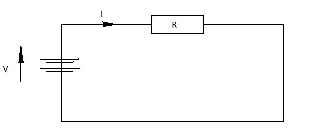

#The Ohm's Law

The relationship between the electrical current I, passing through a particular 
component in a circuit with a voltage difference across it V is defined by the Ohm's Law:

$$R=\frac{V}{I}$$

where R is the resistance of the component with a voltage V. Resistance measured in Ohms ($\gama$).

Simple circuit, that represents Ohm's Law

{@class=centre}

so if the voltage across the component is V=220V and current that flows in this circuit 
is I=2A then resistance of this component is 

$$R=\frac{220V}{2A}=110 \gama$$

The equation also can be rearranged to give Voltage (current) if other two parameters are known.
 