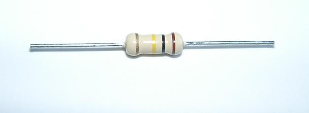
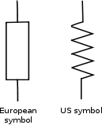
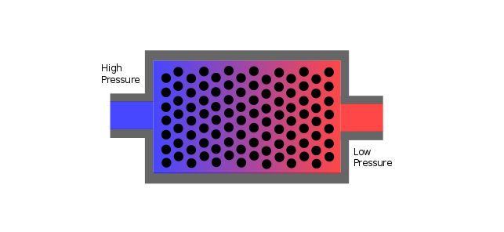

The Resistor
============
{@class=centre}

Resistors are some of the most common components of electronic circuits. They resist the flow of electricity through them, and so create a voltage difference across their terminals according to [Ohms's Law](ohms_law.html).

{@class=centre}

Water analogy
-------------

Resistors in parallel
---------------------

$$\frac{1}{R_{tot}}=\frac{1}{R_1}+\frac{1}{R_2}+...+\frac{1}{R_n}$$

Resitors in series
------------------
$$R_{tot}=R_1+R_2+...+R_n$$

Variable resistors
------------------

{@id=colorcode}
The Color Code
--------------

Exercises
---------

