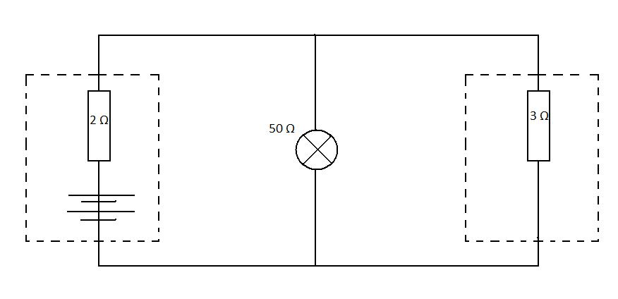

#Superposition theorem

Superposition theorem states that a network containing several voltage sources my be analysed by considering the effect of each source in turn. Simply by changing the voltage source with a resistor that has a value of internal resistance. 
The total current on the component is equal to algebraic sum of all currents obtained from different sources.

The simple example will be considered to represent this theory.

A circuit consists of two voltage sources (bateries) with internal resistance of 2 and 3 ohms respectively and a light bulb with a resistance of 50 ohms.
What is the current that flows through the bulb ?

{@class=centre}
 

Using superposition theorem, lets find the current produced by first baterry.
Replace the second batery with a resistor. The simplyfied circuit becomes:

{@class=centre}
 

From the circuit above we can see that there is one resistor in series and another two in paralel.

Total resistance of the circuit is given by 
$$\frac{1}{R_tot}=R_2+\fraq{1}{R_paralel}=R_2+\frac{R_50+R_3}{R_50R3)=2.35\omega$$

The current through bulb (R_50) can be found using potential divider $V_bulb=\frac{V}{R_tot}R_paralel$ 

So $I_bulb=\frac{V_bulb}{R_50)$ SO $I_bulb=waeva$ 

Now lets consider different batery. Performing same simplifications our circuit becomes:

{@class=centre}
 

And the current of the bulb is $I_bulb=waeva$

Then according to superposition theory the total current that passes through light bulb is equal to I=I1-+I2 = 24242424

If resistance and the current are known, the voltage across this bulb can be easily calculated using Ohm's Law.