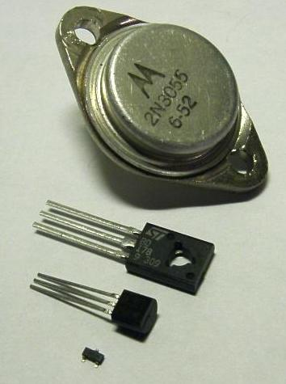

# Transistor

A transistor is a semiconductor device used to amplify and switch electronic signals. It is made of a solid piece of semiconductor material, with at least three terminals for connection to an external circuit. A voltage or current applied to one pair of the transistor's terminals changes the current flowing through another pair of terminals. Because the controlled (output) power can be much more than the controlling (input) power, the transistor provides amplification of a signal. Some transistors are packaged individually but many more are found embedded in integrated circuits.
The transistor is the fundamental building block of modern electronic devices, and its presence is ubiquitous in modern electronic systems.